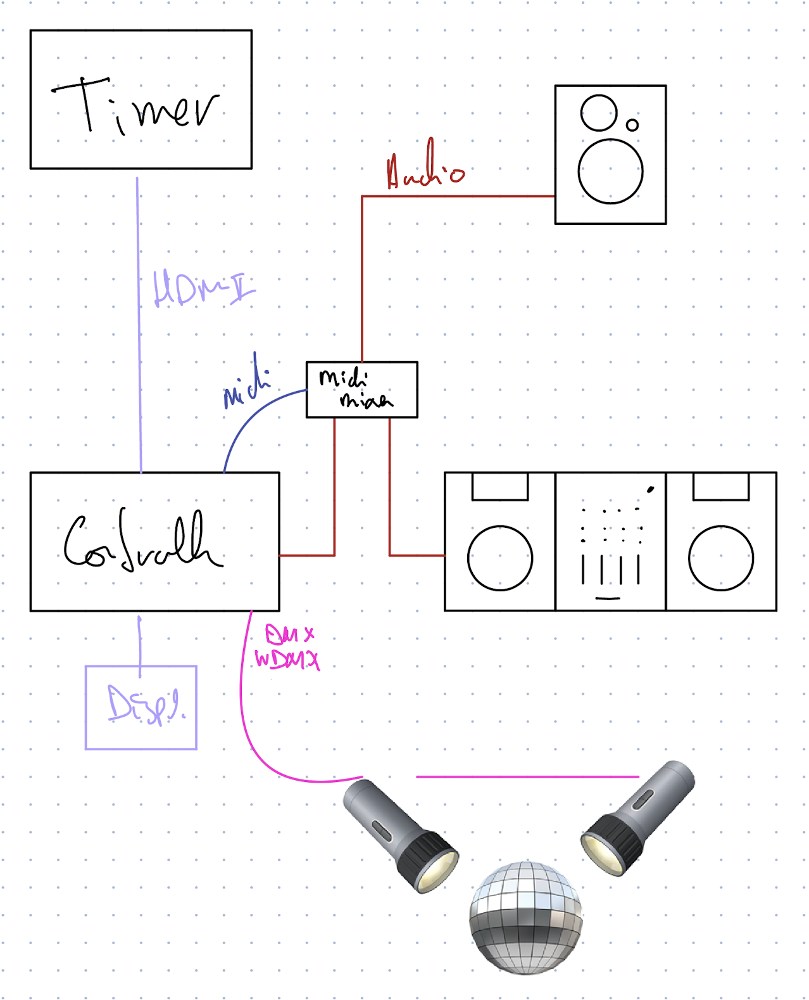
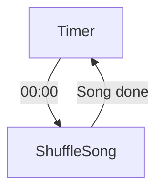

# Shuffle Partey!

An concept conceived by [De Perifeer](https://perifeer.org/) & [Wendbaar.nl](https://www.wendbaar.nl/)

## Synopsis

### Setup:
- There are some light effects
  - A mirrorball w/ pin spots
  - Some effects which respond to music
- There is a screen/ Beamer which displays a Timer
- There is a DJ set
- Each DJ get's an alloted amount of time (like 20 minutes).

### Scenario

- There is a timer displayed on a screen which counts down from say `20:00` to `00:00`
- When the timer expires:
  - the DJ audio fades out and a shuffle track begins to play.
  - the timer on screen fades out and the shuffle logo appears.
- When the shuffle track finishes (or the playhead[^playhead] passes a cue point[^cuepoint])

## Implementation

A picture says more than 1001 words:

[^cuepoint]: A defined position marker that belongs to a track, like the hotques on a Pioneer CDJ.
[^playhead]: The current playback position in the audio player
