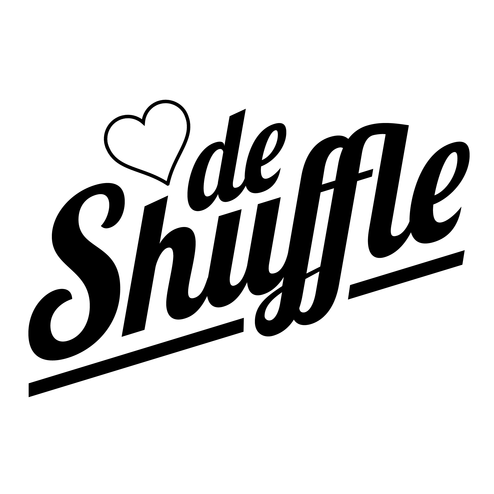
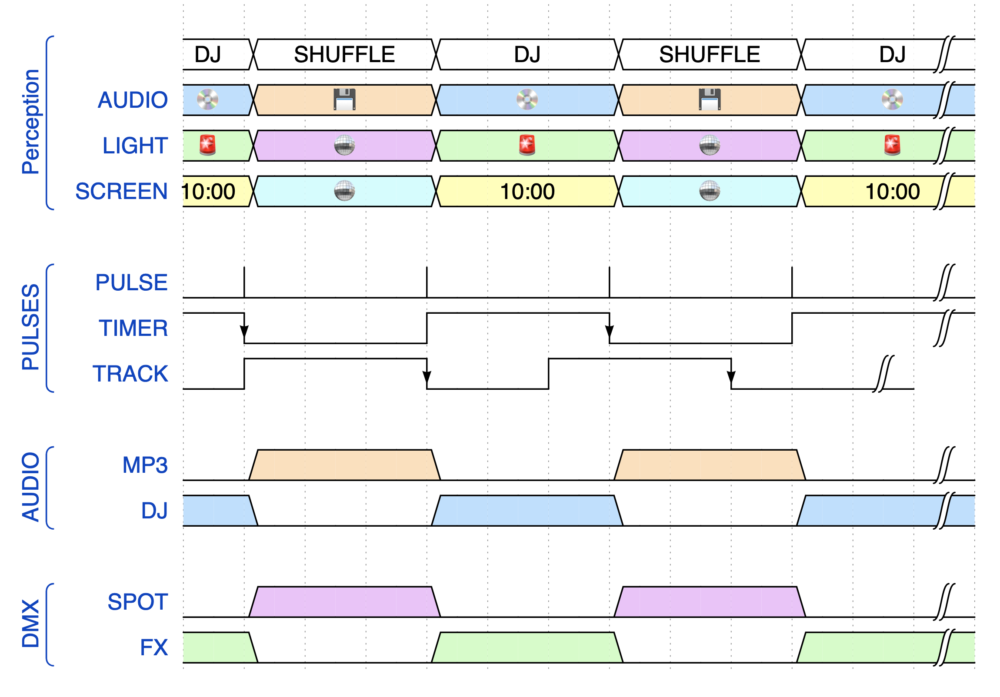

# Shuffle Partey!

An concept conceived by [De Perifeer](https://perifeer.org/) & [Wendbaar.nl](https://www.wendbaar.nl/)

## Synopsis

- Each DJ get's an amount of time (like 20 minutes).
- When the timer expires the dj get's faded out and automagically a shuffle track begins to play.
- When the shuffle track finishes (or the playhead[^playhead] passes a cue point[^cuepoint])

## Implementation

A picture says more than 1001 words:

[^cuepoint]: A defined position marker that belongs to a track, like the hotques on a Pioneer CDJ.
[^playhead]: The current playback position in the audio player
