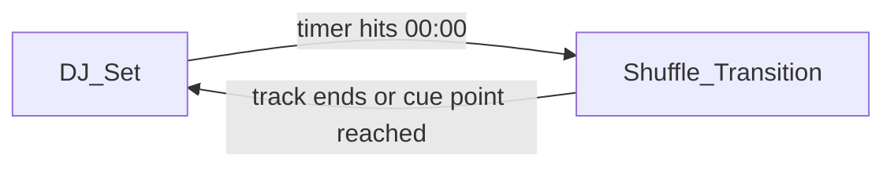

# Shuffle Partey!

A concept conceived by [De Perifeer](https://perifeer.org/) & [Wendbaar.nl](https://www.wendbaar.nl/)

## What Is It?

A DJ rotation party where each DJ gets a fixed time slot (e.g. 20 minutes). When time's up, the system automatically takes over: it fades out the DJ, plays a random "shuffle" transition track with its own light show, and then hands the stage to the next DJ. No MC needed, no operator needed — the system runs fully autonomously once started. Every DJ gets the same cycle, first to last.

## The Experience

**During a DJ set:** The audience sees a countdown timer on screen. The DJ plays their set. Lighting effects respond to the music. The mirrorball pin spots are off.

**When time runs out (the "Shuffle" moment):** The DJ's audio fades out automatically. A random shuffle track from the playlist starts playing. The screen switches from the timer to the Shuffle logo. Lighting shifts — music-reactive effects go dark, mirrorball pin spots come on. This is the moment the next DJ takes position.

**When the shuffle track ends:** The shuffle track audio fades out. The DJ's audio channel opens back up. The timer resets and starts counting down again. Lighting returns to music-reactive mode. The next DJ is live.

## The State Machine

```mermaid
flowchart LR
   DJ_Set -- "timer hits 00:00" --> Shuffle_Transition -- "track ends or cue point reached" --> DJ_Set
```

The system has two states:

| | **DJ Set** | **Shuffle Transition** |
|---|---|---|
| **Audio** | DJ channel open, shuffle track muted | DJ channel faded out, shuffle track playing |
| **Screen** | Countdown timer | Shuffle logo |
| **Lighting** | Music-reactive FX on, pin spots off | FX off, mirrorball pin spots on |
| **Trigger to exit** | Timer reaches `00:00` | Shuffle track ends (or playhead[^playhead] passes a cue point[^cuepoint]) |

## Signal Routing

The system coordinates four output channels, driven by two state signals (`TIMER_STATE` and `TRACK_STATE`) and two pulse events (`TIMER_DONE` and `TRACK_DONE`):

- **Audio — DJ channel:** Controlled via MIDI on a digital mixer (e.g. Behringer XR12). The system sends MIDI CC messages to fade the DJ channel down during shuffle and back up when the next set starts.
- **Audio — Shuffle track:** An MP3 player (software or hardware) routed to a separate mixer channel. A random track is selected from the playlist and triggered by `TIMER_DONE`. Also faded via MIDI.
- **DMX — FX lights:** Music-reactive lighting. On during DJ set, off during shuffle.
- **DMX — Pin spots:** Mirrorball spots. Off during DJ set, on during shuffle.
- **Screen:** A display/beamer showing either the countdown timer or the shuffle logo.

## Implementation Options

| | [TouchDesigner](https://derivative.ca/) | [DragonRuby](https://dragonruby.org/) |
|---|---|---|
| **Approach** | Visual/node-based programming | Code-first (Ruby) |
| **Runs on** | Mac/Windows | Raspberry Pi, Mac, Windows |
| **Audio** | Built-in audio playback + analysis | Needs external audio library |
| **DMX** | Via plugins or OSC | Via serial/USB DMX adapter |
| **Screen output** | Native — designed for visuals | Game engine — capable but DIY |
| **Learning curve** | Low for visual thinkers | Low for programmers |
| **Best for** | Quick prototyping, show visuals | Embedded/standalone deployment |

[^cuepoint]: A defined position marker that belongs to a track, like the hot cues on a Pioneer CDJ.
[^playhead]: The current playback position in the audio player
