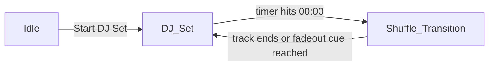

# Shuffle Partey!


A concept conceived by [De Perifeer](https://perifeer.org/) & [Wendbaar.nl](https://www.wendbaar.nl/)

## What Is It?

A DJ rotation party where each DJ gets a fixed time slot (e.g. 20 minutes). When time's up, the system automatically takes over: it fades out the DJ, plays a random "shuffle" transition track with its own light show, and then hands the stage to the next DJ. No MC needed, no operator needed — the system runs fully autonomously once started. Every DJ gets the same cycle, first to last.

## The Experience

**Startup:** The system starts in idle mode, displaying the Shuffle logo. An operator clicks "Start DJ Set" in the control panel (or presses Cmd+F) to begin.

**During a DJ set:** The audience sees a countdown timer on screen. The DJ plays their set. Lighting effects respond to the music. The mirrorball pin spots are off. The next shuffle track is pre-loaded and visible in the control panel.

**When time runs out (the "Shuffle" moment):** The DJ's audio fades out automatically via the mixer crossfade. A random shuffle track starts playing (skipping to its fade-in cue if set). The screen crossfades from the timer to the Shuffle logo. Lighting shifts — music-reactive effects go dark, mirrorball pin spots come on. This is the moment the next DJ takes position.

**When the shuffle track ends (or its fadeout cue is reached):** The shuffle track audio fades out. The DJ's audio channel opens back up. The timer resets after the crossfade completes and starts counting down again. Lighting returns to music-reactive mode. The next DJ is live.

## The State Machine


```mermaid
flowchart LR
   Idle -- "Start DJ Set" --> DJ_Set
   DJ_Set -- "timer hits 00:00" --> Shuffle_Transition -- "track ends or fadeout cue reached" --> DJ_Set
```

The system has three states:

| | **Idle** | **DJ Set** | **Shuffle Transition** |
|---|---|---|---|
| **Audio** | Silent | DJ channel open, shuffle muted | DJ faded out, shuffle playing |
| **Screen** | Shuffle logo | Countdown timer | Shuffle logo |
| **Lighting** | Off | Music-reactive FX on, pin spots off | FX off, pin spots on |
| **Trigger to exit** | "Start DJ Set" button / Cmd+F | Timer reaches `00:00` or "End DJ Set Now" | Track ends or fadeout cue reached |

## Control Panel

A second pygame window provides real-time controls:

- **Status bar** — current state (IDLE / DJ SET / SHUFFLE) and countdown timer
- **Start / Fade button** — starts the DJ set from idle, or triggers early fadeout
- **Set Duration slider** — adjust DJ set length (30s–20min, in 30s steps)
- **Track info** — cover art, artist/title, time remaining, fade-in/out cue times
- **Waveform** — visual waveform with playhead, fade-in (green) and fade-out (orange) cue markers. Click to seek.
- **Pause/Play** — pause the shuffle track (only during shuffle)
- **Skip Track** — load a different random track (only during DJ set)
- **Vertical faders** — master volume (draggable) + DJ L/R and Shuffle L/R channel levels

**Keyboard shortcut:** Cmd+F triggers the same action as the main button from either window.

## MIDI Controllers

The system supports Behringer X-TOUCH controllers for hands-on fader control. Both connect via USB MIDI to the Raspberry Pi (or Mac), and our app translates fader movements to OSC commands for the XR12.

### X-TOUCH ONE — Master Volume

The single motorized fader controls the XR12 master LR bus. The fader is bidirectional: it moves when volume changes from other sources (buttons, control panel UI).

### X-TOUCH EXTENDER — Channel Volumes

The 8 motorized faders map to XR12 input channels. Configured stereo pairs (DJ L+R and Shuffle L+R) are automatically combined onto a single fader:

| Fader | XR12 Channels | Notes |
|---|---|---|
| 1 | 1 + 2 | Shuffle stereo pair (linked) |
| 2 | 3 + 4 | DJ stereo pair (linked) |
| 3 | 5 | |
| 4 | 6 | |
| ... | ... | Up to fader 8 |

*(Fader assignment depends on your `DJ_CHANNEL_L/R` and `SHUFFLE_CHANNEL_L/R` config.)*

During automated crossfades, the DJ and Shuffle faders move to track the fade progress. Manual adjustments override the automated levels.

### Configuration

Both controllers auto-detect by scanning MIDI port names. Override with environment variables if needed:

```bash
MIDI_PORT=X-TOUCH ONE          # or any substring of the MIDI port name
MIDI_EXTENDER_PORT=X-TOUCH-EXT
```

### Why not connect the X-TOUCH directly to the XR12?

The XR12 has MIDI DIN In/Out on the rear panel and supports Mackie Control protocol, so a direct connection is possible. However, routing through our app keeps the automated crossfade system in control — the motorized faders track state transitions and the app coordinates audio, lighting, and display in sync.

The XR12's USB port is for flash drive recording only (no USB MIDI).

## reTerminal Buttons

On a Seeed Studio reTerminal, the front-panel buttons are mapped as hardware controls:

| Button | Action |
|---|---|
| **F1** | Master volume down (−5%) |
| **F2** | Master volume up (+5%) |
| **F3** | Skip track (during DJ set) |
| **O** (circular) | Start DJ set (from idle) or initiate crossfade (during DJ set) |

### Finding the correct input device

The buttons appear as a Linux input device. To identify which one:

```bash
# List all input devices
cat /proc/bus/input/devices

# Interactively test — press buttons and watch for events
sudo evtest
```

Set the device path in your `.env` if it's not the default `/dev/input/event0`:

```bash
BUTTON_DEVICE=/dev/input/event3
```

If the "O" button maps to a different key code than `KEY_ENTER` (28), update `_KEY_O` in `src/shuffle_party/buttons.py`.

## Fade Cue Points

Tracks can have ID3 tags that control playback boundaries:

- **`TXXX:FADEIN_MS`** — skip the intro, start playback here
- **`TXXX:FADEOUT_MS`** — trigger automatic fadeout at this position instead of waiting for track end

### Auto-detection

The `scripts/auto_fadeout.py` script analyzes audio levels to detect fade points automatically:

```bash
# Preview detection without writing tags
uv run python scripts/auto_fadeout.py tracks/*.mp3 --dry-run

# Write tags and generate verification images
uv run python scripts/auto_fadeout.py tracks/*.mp3

# Adjust sensitivity (higher = earlier cue, default 6 dB)
uv run python scripts/auto_fadeout.py tracks/*.mp3 --drop 10
```

Preview images are saved to `fadeout_preview/` with green (fade-in) and orange (fade-out) markers.

### Manual editing

```bash
# Show current cues
uv run python scripts/set_fadeout.py tracks/song.mp3

# Set fadeout at 3:30
uv run python scripts/set_fadeout.py tracks/song.mp3 3:30

# Remove fadeout cue
uv run python scripts/set_fadeout.py tracks/song.mp3 --remove
```

Or use [Kid3](https://kid3.kde.org/) to edit `TXXX:FADEIN_MS` / `TXXX:FADEOUT_MS` tags directly.

## Signal Routing


The system coordinates 2 stereo audio output channels and DMX lightning, all driven by two state signals (`TIMER_STATE` and `TRACK_STATE`) and two pulse events (`TIMER_DONE` and `TRACK_DONE`):

- **Audio — DJ channel:** Controlled via OSC on a digital mixer (e.g. Behringer XR12). OSC over WiFi/Ethernet (UDP port 10023). Optionally, X-TOUCH MIDI controllers provide hands-on fader control routed through the app.
- **Audio — Shuffle track:** pygame.mixer plays an MP3 routed to a separate mixer channel. A random track is selected and pre-loaded during the DJ set, triggered by timer expiry.
- **DMX — Pin spots:** DMX Mirrorball spots. Off during DJ set, on during shuffle.
- **DMX — FX lights:** Showtec LED Par 56 Short DMX par spots. On during DJ set, off during shuffle.
- **Screen:** A display/beamer showing either the countdown timer or the shuffle logo.


## Setup

Install [uv](https://docs.astral.sh/uv/) and set up the project:

```bash
curl -LsSf https://astral.sh/uv/install.sh | sh
uv sync --group dev
```

Run with:

```bash
uv run python -m shuffle_party
```

Or use the startup script:

```bash
./start.sh
```

Put your shuffle transition MP3s in `./tracks/` before starting.

## Development Commands

| Task | Command |
|---|---|
| Sync dependencies | `uv sync --group dev` |
| Run app | `uv run python -m shuffle_party` |
| Run tests | `uv run pytest` |
| Lint | `uv run ruff check src/ tests/` |
| Lint (auto-fix) | `uv run ruff check --fix src/ tests/` |
| Type check | `uv run mypy src/` |
| Add dependency | `uv add package-name` |
| Add dev dependency | `uv add --group dev package-name` |

## Project Structure

```
ShuffleParty/
  ├── src/
  │   └── shuffle_party/
  │       ├── __init__.py
  │       ├── __main__.py        (pygame dual-window event loop + display rendering)
  │       ├── app.py              (state machine: IDLE → DJ_SET ↔ SHUFFLE)
  │       ├── buttons.py           (reTerminal front-panel buttons via evdev)
  │       ├── config.py           (settings with .env overrides)
  │       ├── control_panel.py    (pygame control window: buttons, sliders, waveform)
  │       ├── midi_controller.py  (X-TOUCH ONE + EXTENDER MIDI fader control)
  │       ├── mixer.py            (XR12 OSC crossfade + channel volume)
  │       ├── lighting.py         (Enttec DMX USB Pro: pin spots + audio-reactive pars)
  │       ├── display.py          (countdown timer logic)
  │       └── track_picker.py     (random MP3 selection)
  ├── scripts/
  │   ├── auto_fadeout.py         (detect fade-in/out cues, write tags, generate previews)
  │   └── set_fadeout.py          (CLI tool to set/show/remove FADEOUT_MS tags)
  ├── tests/
  ├── tracks/                     (shuffle transition MP3s)
  ├── pyproject.toml
  ├── start.sh
  └── README.md
```

## Docs:

### Showtec LED Par 56 Short DMX

DMX Channels

- Channel 1 – Red
- Channel 2 – Green
- Channel 3 – Blue
- Channel 4 – Full Color
- Channel 5 – Strobe and Speed
- Channel 6 – Modi
  - Mode 1 - 0 - 63 RGB control
  - Mode 2 - 64 – 127 7 color fade
  - Mode 3 - 128 – 191 7 color change
  - Mode 4 - 192 – 255 music-controlled
