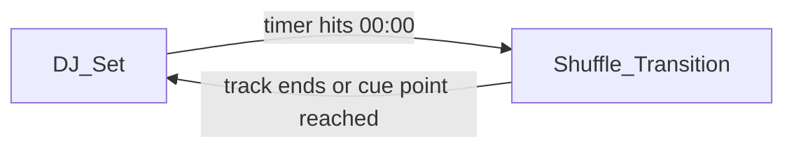
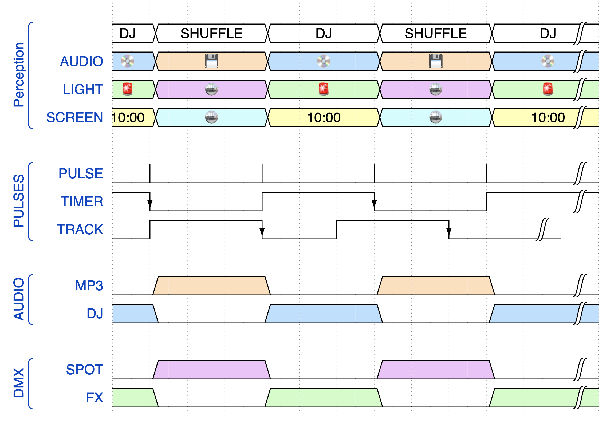
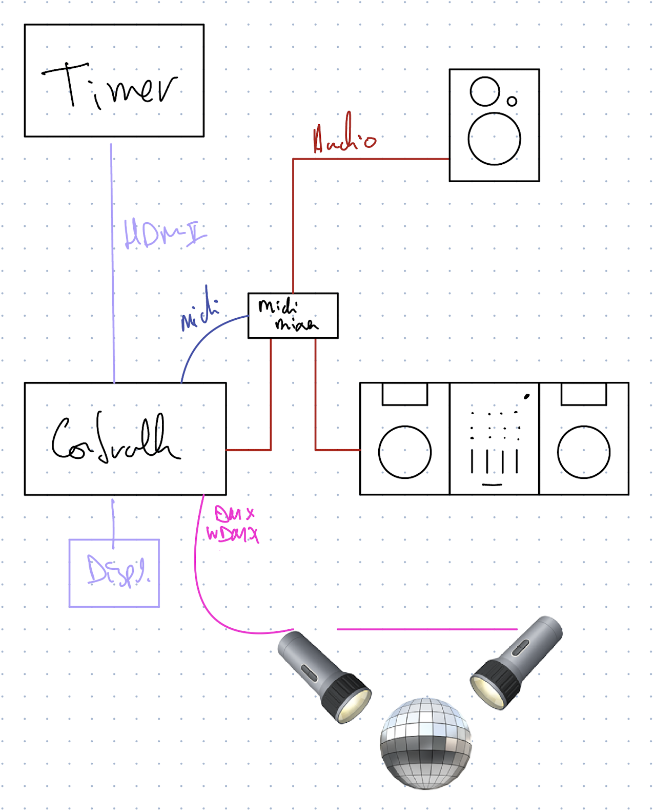

# Shuffle Partey!


A concept conceived by [De Perifeer](https://perifeer.org/) & [Wendbaar.nl](https://www.wendbaar.nl/)

## What Is It?

A DJ rotation party where each DJ gets a fixed time slot (e.g. 20 minutes). When time's up, the system automatically takes over: it fades out the DJ, plays a random "shuffle" transition track with its own light show, and then hands the stage to the next DJ. No MC needed, no operator needed — the system runs fully autonomously once started. Every DJ gets the same cycle, first to last.

## The Experience

**During a DJ set:** The audience sees a countdown timer on screen. The DJ plays their set. Lighting effects respond to the music. The mirrorball pin spots are off.

**When time runs out (the "Shuffle" moment):** The DJ's audio fades out automatically. A random shuffle track from the playlist starts playing. The screen switches from the timer to the Shuffle logo. Lighting shifts — music-reactive effects go dark, mirrorball pin spots come on. This is the moment the next DJ takes position.

**When the shuffle track ends:** The shuffle track audio fades out. The DJ's audio channel opens back up. The timer resets and starts counting down again. Lighting returns to music-reactive mode. The next DJ is live.

## The State Machine


```mermaid
flowchart LR
   DJ_Set -- "timer hits 00:00" --> Shuffle_Transition -- "track ends or cue point reached" --> DJ_Set
```

The system has two states:

| | **DJ Set** | **Shuffle Transition** |
|---|---|---|
| **Audio** | DJ channel open, shuffle track muted | DJ channel faded out, shuffle track playing |
| **Screen** | Countdown timer | Shuffle logo |
| **Lighting** | Music-reactive FX on, pin spots off | FX off, mirrorball pin spots on |
| **Trigger to exit** | Timer reaches `00:00` | Shuffle track ends (or playhead[^playhead] passes a cue point[^cuepoint]) |

## Signal Routing



The system coordinates four output channels, driven by two state signals (`TIMER_STATE` and `TRACK_STATE`) and two pulse events (`TIMER_DONE` and `TRACK_DONE`):

- **Audio — DJ channel:** Controlled via OSC or MIDI on a digital mixer (e.g. Behringer XR12). The XR12 supports both MIDI CC and OSC over WiFi/Ethernet (UDP port 10023). OSC is preferred — no USB MIDI interface needed, just a network connection.
- **Audio — Shuffle track:** An MP3 player (software or hardware) routed to a separate mixer channel. A random track is selected from the playlist and triggered by `TIMER_DONE`. Also faded via OSC/MIDI.
- **DMX — FX lights:** Music-reactive lighting. On during DJ set, off during shuffle. Controlled by [QLC+](https://www.qlcplus.org/), triggered via OSC from the Python process.
- **DMX — Pin spots:** Mirrorball spots. Off during DJ set, on during shuffle. Also driven by QLC+ scenes.
- **Screen:** A display/beamer showing either the countdown timer or the shuffle logo.



## Implementation Options

### Recommended: Python on Raspberry Pi

A single Python process running on a Raspberry Pi covers all requirements:

| Capability | Library | Notes |
|---|---|---|
| **Audio playback** | `pygame.mixer` | MP3 playback, fade control, track-end detection |
| **Mixer control** | [`xair-api`](https://pypi.org/project/xair-api/) | Controls XR12 faders directly via OSC/WiFi — no MIDI hardware needed |
| **DMX** | [QLC+](https://www.qlcplus.org/) | Lighting control companion app, triggered via OSC from Python |
| **Screen output** | `pygame` fullscreen | Countdown timer + shuffle logo |
| **State machine** | Plain Python | Two states, four outputs, ~100 lines |

### Setup

```bash
python3 -m venv .venv
source .venv/bin/activate
pip install pygame-ce python-osc xair-api
```

Run with:

```bash
python main.py
```

Put your shuffle transition MP3s in `./tracks/` before starting.

### Alternatives

| | Python | Node.js + Chromium | openFrameworks | TouchDesigner | DragonRuby |
|---|---|---|---|---|---|
| **Audio** | pygame.mixer | Web Audio / mpv | Built-in | Built-in | Needs external lib |
| **XR12 control** | `xair-api` (OSC) | `osc.js` | `ofxOsc` | OSC nodes | No OSC support |
| **DMX** | OLA | `node-dmx` | `ofxDmx` | Plugins/OSC | Serial/USB adapter |
| **Visuals** | Basic (pygame) | Excellent (HTML/CSS) | Excellent (OpenGL) | Excellent | Good (game engine) |
| **Runs on Pi** | Yes | Yes (heavy) | Yes | No | Yes |
| **Complexity** | Low | Medium | High | Low | Medium |
| **Best for** | This project | Polished screen output | Future visual upgrades | Quick prototyping | Embedded Ruby |

**Python wins** because [`xair-api`](https://pypi.org/project/xair-api/) gives direct fader control over the XR12 via WiFi, [QLC+](https://www.qlcplus.org/) handles all DMX fixture management and light show design (triggered via OSC), and `pygame` handles both audio and display.

[^cuepoint]: A defined position marker that belongs to a track, like the hot cues on a Pioneer CDJ.
[^playhead]: The current playback position in the audio player
